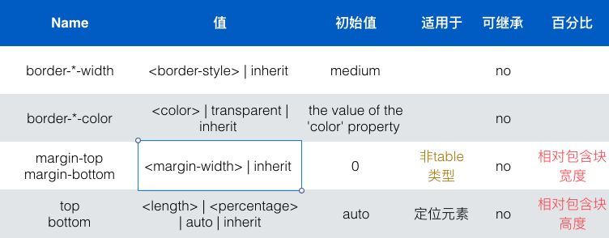

# Layout & Size Calculation
[@fedeoo](https://blog.fedeoo.cn)

---

### In this lecture:

* Something you should know
* Box model
* Visual Formating Model
* Containing block
* Positioning
* box dimensions

---

## Somthing you should know

----

### Value process

`specified` → computed → used → actual

----

### Value process

* specified value  
  `winning Cascaded Values` || inherit || iniital
<!-- .element: class="fragment" data-fragment-index="2" -->

* computed value   
  `simply` transfer from parent. e.g., em, ex, bolder, etc.
<!-- .element: class="fragment" data-fragment-index="3" -->

* used value   
  calculations. e.g., `width:auto`, etc.
<!-- .element: class="fragment" data-fragment-index="4" -->

* actual value    
  UA adjustment. e.g., border-width, font-size, etc.
<!-- .element: class="fragment" data-fragment-index="5" -->

----

### Value process

See [Examples](https://www.w3.org/TR/css3-cascade/#stages-examples)

---

### Box model

---

## Containing blocks

box positions and sizes

----

### css property table

----

  <pre><code>
    .border-style {
      border: solid pink;
      border-left: double;
      color: aqua;
    }
  </code></pre>

---

## Visual Formating Model

----

### Block-level elements and block boxes

* Block-level boxes (Block Formating Context)
* block container box
* Anonymous block boxes

----

  
      行内文本
      
块级元素P

      紧跟着的行内文本内容
      height
  
  <pre><code>
    
        行内文本
        
块级元素P

        紧跟着的行内文本内容
        height
    
  </code></pre>

----

### Inline-level elements and inline boxes

*  inline box (Inline Formating Context)
* atomic inline-level boxes   
  inline-block
* Anonymous inline boxes
  <pre><code>some text inline more text</code></pre>

----

### BFC

#### establish new BFC

  * absolutely positioned elements(float fixed absolute)
  * block containers(inline-block table-cell table-caption)
  * overflow:not visiable

----

* Box垂直方向布局 紧邻的块级盒 垂直margin会合并
* 每个盒的左外边缘和包含块的左边缘对齐，即使存在浮动
由于浮动的存在，line box宽度会收缩

----

文本在前又如何？
I'm float

normal

 虽然内容是从这儿开始，但是该盒的左边缘依然与包含块的左边缘对齐。该盒中的line box宽度确实收缩

<pre><code>

文本在前又如何？
I'm float

normal

 虽然内容是从这儿开始，但是该盒的左边缘依然与包含块的左边缘对齐。该盒中的line box宽度确实收缩

</code></pre>

---

## Positioning

----

### collapsing margins

* 普通流中在同一块格式化上下文(BFC)中的两个块级盒的外边距
* 没有行盒，没有间隙，没有内边距和没有边框将两外边距隔开
* max(正) + min(负)

----

<pre><code>#first {
    background:aqua;
    margin-bottom:20px;
}</code></pre>

    
float

    
<pre><code>
#sub {
    margin-top:10px;
    background:#8cc540;
}</code></pre>

    

    <pre><code>#second {
    background:pink;
    margin-top:30px;
}</code></pre>

See [detail](http://jsfiddle.net/fedeoo/c6Am9/)

----

### float clear && clearance

1. 不考虑clear时 按照间距重叠 C1 = max(M1, M2)  
2. 考虑间隙的出现，放到浮动元素底部 C2 = M1 + H

3. 取MAX(C1, C2)

----

    

  <pre><code>
  #B1{
    margin-bottom: 40px;
}</code></pre>

    
<pre><code>#float{
    float: left;
    height: 120px;
}</code></pre>

    
<pre><code>#B2{
    margin-top: 70px;
    clear: both;
}</code></pre>

See [detail](http://fiddle.jshell.net/fedeoo/6rzw6s6x/)

---

## box dimensions

----

### Calculating widths and margins

* Inline, non-replaced elements

* Inline, replaced elements (img)

* 块级替换元素
(width与行内替换元素相同规则，margin的取值也遵循上面规则)

----

### Block-level, non-replaced elements in normal flow


<small>'margin-left' + 'border-left-width' + 'padding-left' + 'width' + 'padding-right' + 'border-right-width' + 'margin-right' = width of containing block</small>

1. width不为auto，左侧大于右侧，margin的auto值视为0

2. 根据包含块的direction 值为ltr，忽略margin-right；rtl 忽视 margin-left

3. width为auto 其余auto取0值，
如果margin-left margin-right都是auto，它们的使用值相等。
4. 行内元素、浮动元素、inline-block
 margin计算值为auto，使用值取0

----

    
过度约束<pre><code>#first {
    width: 420px;
    height:200px;
    margin:0 60px;
}</code></pre>

    
<pre><code>#second {
    margin: 0 auto;
    width: 420px;
    padding: 0 20px;
}</code></pre>

See [detail](http://jsfiddle.net/Gn3Db/2/)

----

### Absolutely positioned, non-replaced elements

<small>‘left’ + 'margin-left' + 'border-left-width' + 'padding-left' + 'width' + 'padding-right' + 'border-right-width' + 'margin-right' + 'right' = width of containing block</small>

1. 如果left、right、width都为auto，先设margin中auto值为0，再根据 direction 设置 left 或 right 为 static position。
2. 三个值都不为auto，计算margin
3. 否则，设置margin中auto值为0；只有一个auto值，根据等式计算；如果width和其中一个为auto，width取shrink-to-fit值，计算另一个。

----

### max-width min-width


1. 先按正常计算；

2. 如果计算的width>max-width;width取max-width重新计算

3. 如果计算的width<min-width;width取min-width重新计算

----

### 高度计算

1. 行内非替换元素
内容高度依赖字体，line box高度根据line-height
2. 替换元素
margin auto 使用值取 0
3. 块级非替换元素，正常流 overflow:visible
margin auto 使用值取 0 如果高度是auto，高度取决于是否有块级子元素是否有padding和border
高度等于top content edge到
1.最后一个line box的底边(如果它建了一个IFC)[demo]
2.流内最后一个子元素的底边距（可能是匿名块盒）

----

### 高度计算

 <small>'top' + 'margin-top' + 'border-top-width' + 'padding-top' + 'height' + 'padding-bottom' + 'border-bottom-width' + 'margin-bottom' + 'bottom' = height of containing block</small>

1. 如果'top', 'height', and ‘bottom’都为auto,设top为static位置值，用下面的规则2
2. 如果都不为auto，margin值为auto, 添加上下margin相等约束计算margin
否则
1. 如果height不为auto，top和bottom为auto，设top为static位置值
2. height和top或bottom为auto，先根据BFC块计算height规则求height,再计算另一值
3. 如果只有一个为auto,根据等式计算
margin中auto值为0，计算等式

----

    
<pre><code>#center {
    position: absolute;
    height: 240px;
    background-color: pink;
    top: 0px;
    bottom: 0px;
    margin: auto;
}</code></pre>
    

See [detail](http://fiddle.jshell.net/fedeoo/fhqf2ogd/)

----

<small>块级非替换；overflow值为非visible；inline-block非替换元素；浮动；非替换元素</small>
<small>如果 'margin-top', or 'margin-bottom' 值为 'auto', used value 使用 0。</small>

BFC高度计算规则


1. 如果只包含行内元素：高度为最顶的line box 到最低的line box、
2. 如果包含块级元素：最顶块级盒的上边距边缘到最底块级盒的
3. 忽视absolute元素，相对定位不考虑偏移

另外，如果浮动底边距边缘低于它的低边缘，增加高度使得包含float; 只有处于该BFC的float才会被考虑在内，如在absolute中的float不会被考虑。

----

### BFC & float collapse

    

    
<pre><code>#float {
    float: left;
    width: 150px;
    background-color: lightyellow;
}</code></pre>
  
    

        

    
  

See [detail](http://fiddle.jshell.net/fedeoo/f1gajgba/)

----

### max-height min-height

1.
先按上述规则计算
2. 如果大于max,取max值重新计算
3. 如果小于min,取min重新计算

----

### line-height计算

1. 对行内级元素，line-height说明行盒的最小高度
2. line box高度
替换元素、inline-block是盒的height 行内盒是line-height
3. 行内级盒在垂直方向上按照vertical-align属性对齐
4. line-height 16px font-size 12px上下会加2px空白


----

    
    下面没对齐的感觉。 

See [detail](http://fiddle.jshell.net/fedeoo/e7Z8g/)

---

## Further Reading

* [writing-css](http://justineo.github.io/slideshows/writing-css)
* [w3c css 2.1](https://www.w3.org/TR/CSS21/)

---

## Q ? A : Thanks
